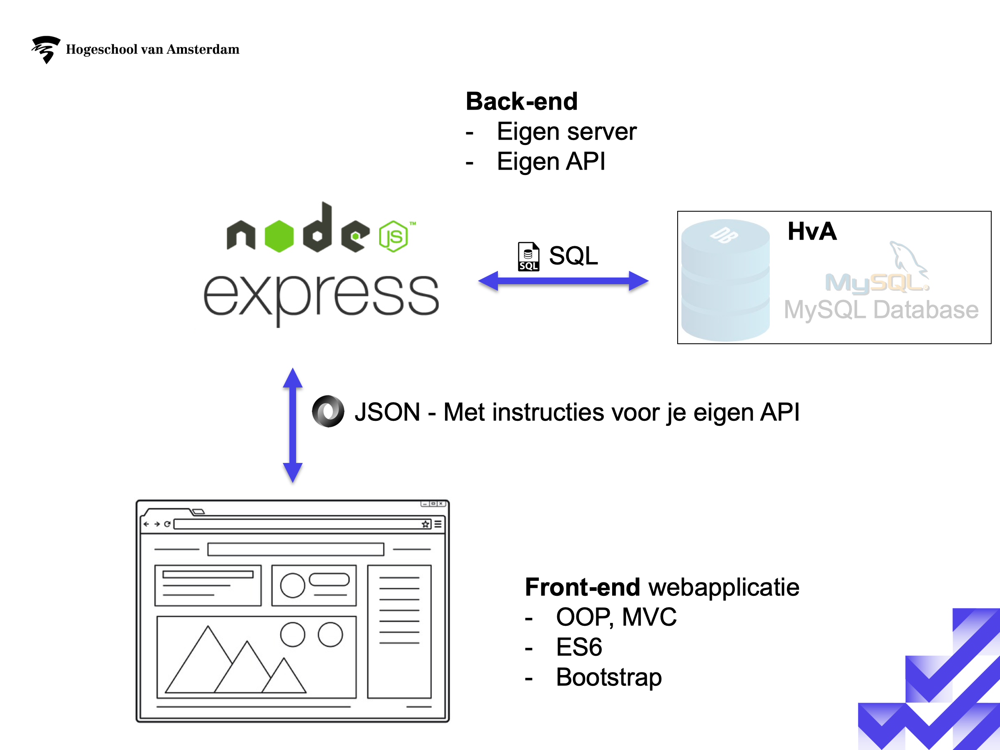
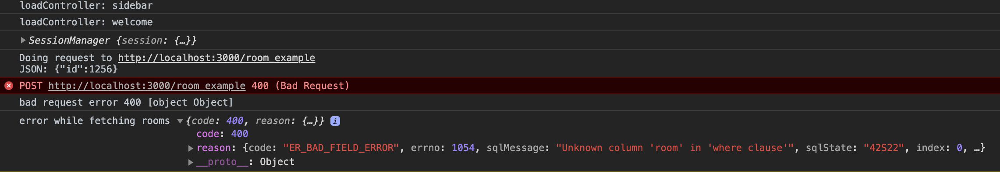

# PAD framework

## Wat zit er in het framework?

**Back-end(server)**
- Opzet standaard webserver met Express.JS en NodeJS. 
    - API: Hierbij zit een  `/login`  en `/room_example` route. Deze worden al aangesproken in de front-end
    - Connectie met een MySQL database. Deze database staat net als bij FYS ergens op een server binnen de HvA.
- Enkele crypto helper functions voor bijv. het hashen van een wachtwoord
- Standaard logging met foutmeldingen en andere informatie

**Front-end(HTML, CSS, JS)**
- Bootstrap 4 voorbeeld layout
- MVC setup met twee voorbeelflows: een login en een stukje testdata
    - `views` bevat de HTML pagina's
    - `controllers` bevat controllers - de schakeling tussen de views en de data
    - `repositories` omdat we in Javascript(ES6) geen expliciete types hebben is er niet echt een model. Een repository bevat/haalt data op en geeft het terug aan een controller.
- `sessionManager.js` voor het beheren van sessies in de browser
- `networkManager.js` voor het uitvoeren van netwerk request(AJAX) naar jullie eigen API

## Setup

### Dependencies - vooraf installeren!

- MySQL - deze zou je nog moeten hebben van databases
- NodeJS - https://nodejs.org/en/download/ - Pak de LTS versie 
- Git

### Stappen om het framework voor het eerst te draaien

1. Clone het project via Fork. Open het geclonede project in IntelliJ. Het is een vereiste om IntelliJ te gebruiken tijdens PAD.
2. Configureer ```server/config/users.json``` voor de connectie naar jullie database. Deze gegevens vinden jullie op de PAD cloud. 
3. Open het tabje terminal in IntellIJ(linksonderin), zorg dat je in de folder `pad-framework` zit.  Draai vervolgens ```npm install```. 
4. Daarna kun je de server runnen door ```nodemon server/server.js```(auto refresh on code change) of `node server/server.js` te typen.
5. Open ```src/index.html``` in de browser. Je kunt hiervoor op het Chrome(of andere browser) icoontje rechtsbovenin de file klikken.

## Server en Client

In de `server` folder vind je alles wat met de back-end/server te maken heeft, voor nu houden we het op de naamgeving server.
Door middel van het draaien van ```nodemon server/server.js``` komt de server te draaien op een port(denk aan infrastructures!).

In de folder `src` vind je alle HTML/CSS en JS, ook wel de front-end. Vanuit deze front-end kun je dus een request doen naar hierboven genoemde server. 
Bij FYS hoefde je niet zelf de server te beheren en kon je een request doen naar de FYSCloud API. Bij PAD ga je dit dus ook zelf doen, je gaat dus je eigen
server beheren die je eigen API bevat voor je eigen front-end

Weet je niet helemaal meer hoe het zat met Server, Client, GET, POST, query parameters en URL's? Doe les 1 van de course Client-Server Communication:

https://classroom.udacity.com/courses/ud897/ 

## Voorbeeld van een flow(Welcome scherm)



**Front-end**

`pad-framework/src`

1. `src/assets/js/app.js` is het startpunt van de front-end applicatie. Deze laadt altijd de `navBarController.js` welke verantwoordelijk is
voor de navigatie binnen de website. Deze controller vangt een klik af op een link en vraagt via `app.js` een andere controller op voor de betreffende pagina.
In dit voorbeeld is dit de `welcomeController.js`.
2. De `welcomeController.js` laadt de pagina `welcome.html` (V en C van MVC)
3. Deze controller maakt ook een instantie van `roomExampleRepostitory.js`. 
4. Via deze repository(komt nog aan bod bij OOP2) wordt er data(rooms) opgevraagd: `const roomData = await this.roomExampleRepository.get(roomId);`. Door middel van het gebruik van
 `async/await` hoeven we geen callbacks te gebruiken. De repository spreekt de `networkManager.js` aan welke uitendelijk
een `AJAX` request doet naar de server.
5. De networkManager gaat een request doen naar jullie API op jullie server. Hier worden de juiste waardes aan meegegeven zoals welke
room wordt opgevraagd. Dit wordt gedaan in JSON formaat. Je ziet dit in de console:
`Doing request to http://localhost:3000/room_example
JSON: {"id":1256}`

**Server**

`pad-framework/server
`
6. De server draait bijv. op port 3000. Deze luistert of er requests binnen komen. Specifiek gebeurt dit in `server/app.js`. 
7. In dit geval zal de volgende route getriggered worden: `app.post('/room_example', (req, res) => { .. }`. Dit is een stukje code dat gebruik
maakt van `Express.JS`. In de course over NodeJS(zie studiehandleiding en links onderop) vind je meer over Express.JS.
8. Zoals je ziet verwachten we hier een `POST` request. Uit de `req` parameter kunnen we de JSON vissen die uit de front-end verstuurd is(id van room).
9. Binnen deze route kunnen we gebruik maken van `db.js`. Dit script beheert de connectie naar de MySQL database. De functie `handleQuery(..)` kan een stukje data ophalen uit de database.
10. De laatste stap is om binnen deze route in `app.js` de data ook weer in JSON formaat terug te geven aan de front-end: `res.status(httpOkCode).json(data);`
Let ook op dat je ook altijd wat terug moet geven als het fout gaat: `(err) => res.status(badRequestCode).json({reason: err})`

Zie verder in de `welcomeController.js` hoe deze data dan weer op het scherm getoond wordt. Let wel op dat dit asynchroon(`async`) gebeurt. 


## Links/E-learning

### NodeJS/Express/NPM

- Learning Node.js https://www.linkedin.com/learning/learning-node-js-2
    - Chapter 1, 2 en 4 → Dit zijn de essentials binnen het NodeJS ecosysteem die je nodig hebt tijdens het project. Hier leer je
    meer over de basis van NodeJS, NPM(packages.json) en Express.JS.
    - Chapter 7,8 en 9 → Deze hoofdstukken gaan in op de wat moeilijkere concepten zoals asynchrone code, software testen en error handling.
    
### Client-Server Communication
    
https://classroom.udacity.com/courses/ud897/ 

In ieder geval les 1 is belangrijk. Les 5 over security is ook interessant, hier kom je ook meer te weten over wat CORS(`server/utils/corsConfig.js`) is. 

### ES6

- ES6 – Een nieuwe versie van Javascript die in de front-end gebruiken https://classroom.udacity.com/courses/ud356
    - Lesson 1: 1tm5 + 10tm13 → Dit is het minimum van les 1, de rest is zeker ook interessant!
    - Lesson 2: 1tm9 + 12tm21 → Classes en Inheritance, nieuwe manier van functies schrijven t.o.v. FYS en het gebruik van het “this” keyword

### Bootstrap - layout toolkit voor HTML/CSS en JS

Hoe richt ik mijn layout in?

https://getbootstrap.com/docs/4.4/layout/grid/

Hoe verander ik padding/marging?

https://getbootstrap.com/docs/4.4/utilities/spacing/

Hoe verander ik kleuren?

https://getbootstrap.com/docs/4.4/utilities/colors/

Teksten

https://getbootstrap.com/docs/4.4/utilities/text/


## Troubleshooting

_ Bij het runnen van de server krijg ik de melding port already in use:_

Eindig het proces node in taakbeheer en draai de server nog een keer.

_Ik krijg errors in de console:_



Het is hierbij van belang dat je goed kijkt wat er misgaat. Het kan nameelijk zoals in dit geval zo zijn dat er 
ook iets in het servergedeelte niet goed staat. Hier wordt een niet bestaand veld gequery'ed.

## Deployen naar PAD Cloud(WIP) - v.a. sprint 2/3

- Nooit `node_modules` uploaden
